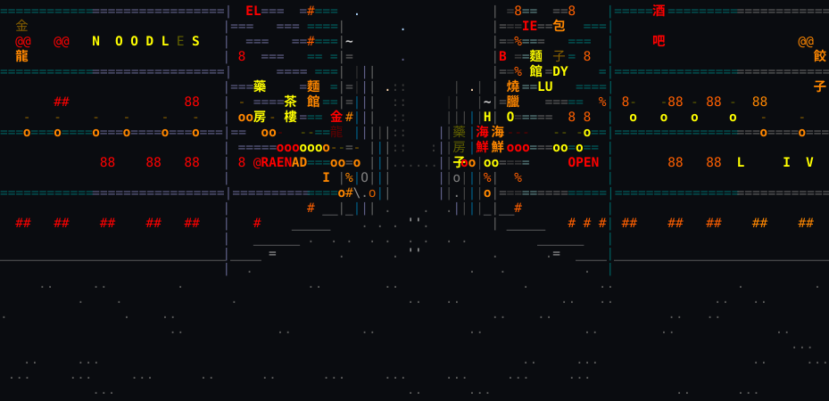
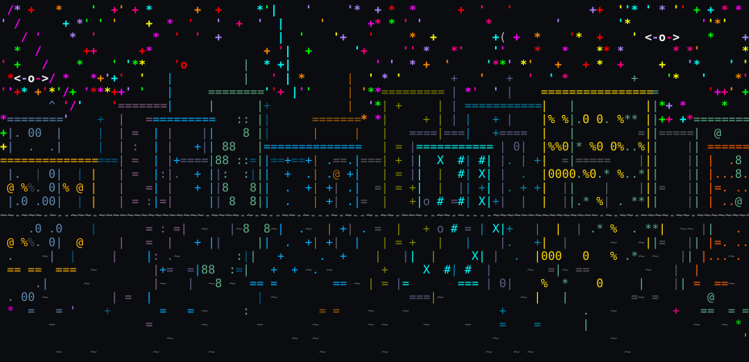

# ascii_city

Inspired by [Grow Now! Games](https://youtu.be/3YtygAx_C6A).

An endless, procedurally generated city you can walk around in your terminal.

```bash
python3 ascii_city.py
```

Stdlib-only Python — `curses` and some arithmetic, no dependencies, no build step.



*A street in Chinatown — hung signs, lanterns, somebody smoking outside.*



*The waterfront on a clear night, with the milky way up.*

## What is in it

Two views, sharing one clock and one weather: **the street**, walked in first person with free
turning, and **the waterfront**, the whole city seen from across the water. `tab` switches.

- **Nine parts of town** — downtown under the neon, quiet housing, Chinatown and a night market
  strung with lanterns, a financial district that is black but for the floor the cleaners are on,
  the docks, the old town, and small parks.
- **Weather that runs itself** — rain that comes and goes, and storms that are rare, violent, and
  the only thing that brings lightning.
- **A night sky with a different character every night** — clarity, the moon's phase, whether the
  milky way is up, the odd meteor. Once in a great while, something else entirely.
- **Places you can go into** — a casino with a roulette wheel that spins honestly, and a club with
  a rave going on.
- **Dark alleys**, some of which dead-end, and lit ones lined with tiny bars.
- **The woods** — one great block of trees, a long walk from anywhere, with trails you can get
  lost on, things in the dark with eyes, and once in a while a rave in the hollow in the middle
  that nobody asked permission for.
- **A river**, with piers, buoys, mist on cold nights, and footbridges with lamps along them.

Nothing is stored. Every street, building, sign and trail is a hash of its own coordinates, so
the city is infinite, identical every time you walk back to it, and held in no memory at all.

## Controls

```
  w s        walk            a d     turn        , .   sidestep
  tab        switch view     space   wander on its own
  `          cheat menu      q       quit
```

The cheat menu teleports you to anything worth looking at — it searches the city for what is
already there rather than spawning it, so the rare things stay exactly as rare as they were.

## Tests

```bash
python3 tests/checks.py && python3 tests/pty_checks.py
```

A few hundred assertions, no framework and nothing to install. The first renders frames and counts
what landed where; the second forks a pty and actually plays the thing.

The screenshots above are generated the same way — `python3 tools/screenshot.py` renders a frame and
writes it out as text in an SVG, in the colours the renderer actually picked.

## Notes

`CLAUDE.md` is the long version: how the renderer works, why particular decisions were made, and
the traps that cost time.

Written for fun, with [Claude Code](https://claude.com/claude-code).
